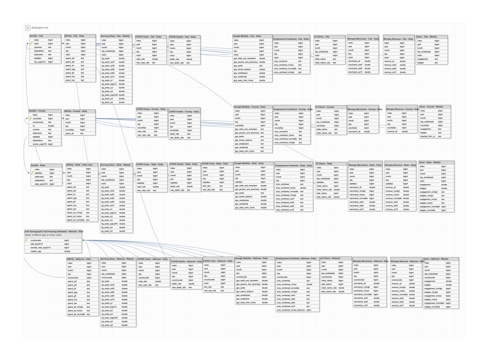

# Database: OIET Data
Data from the Opportunity Insights Economic Tracker as a PostgreSQL database.

# Prerequisites

### Local
  For Mac users: please remove the '.DS_Store' file from the main directory.
If you have already done so globally, you can ignore the following set of instructions.
1) Open your preferred command line interface
2) In command line, run: `cd /path/to/OIET_DATA_DB`
3) In command line, run:` find . -name '.DS_Store' -type f -delete`

# Entity Relationship Diagram
Below is an ERD I created using [dbdesigner.net](https://www.dbdesigner.net/). The majority of the database design was inherited from how the original data files are formatted. This ERD primarily documents the existing structure. A PDF version of the diagram is also available in the `docs` folder.

# Acknowledgements

### Attributions
Below is an aggregated list of all the attributions featured in this project. Each attribution is specifically noted in a comment in the corresponding file.
* Database class definition in Python: [Stack Overflow](https://stackoverflow.com/a/38078544/) under [CC BY-SA 4.0](https://creativecommons.org/licenses/by-sa/4.0/) license.
* Flask app setup and deployment to Heroku: [Real Python: Flask by Example (Parts: 1)](https://realpython.com/flask-by-example-part-1-project-setup/#project-setup)
* Connecting PostgreSQL database to Jupyter Notebook: [Connecting Python Pandas And Jupyter Notebooks To PostgreSQL For Data Analysis](https://blog.panoply.io/connecting-jupyter-notebook-with-postgresql-for-python-data-analysis)
* Deploying a Jupyter Notebook Heroku with Voila: [Deploy a Jupyter Notebook Online with Voila and Heroku](https://pythonforundergradengineers.com/deploy-jupyter-notebook-voila-heroku.html#test-voila-locally)

### Dataset Attributions
This dataset was downloaded from [Kaggle](https://www.kaggle.com/douglaskgaraujo/opportunity-insights-real-time-economic-tracker-us). **A copy of the original [README](docs/oiet_readme.md) for this dataset explains the context and use of the data. This project also has a repository available on [GitHub](https://github.com/OpportunityInsights/EconomicTracker).** Please visit either of these sources to learn more about the project. You can also visit the [Economic Tracker](https://tracktherecovery.org). Below is a citation for the paper accompanying the project:
> "How Did COVID-19 and Stabilization Policies Affect Spending and Employment? A New Real-Time Economic Tracker Based on Private Sector Data", by Raj Chetty, John Friedman, Nathaniel Hendren, Michael Stepner, and the Opportunity Insights Team. June 2020. Available at: https://opportunityinsights.org/wp-content/uploads/2020/05/tracker_paper.pdf

